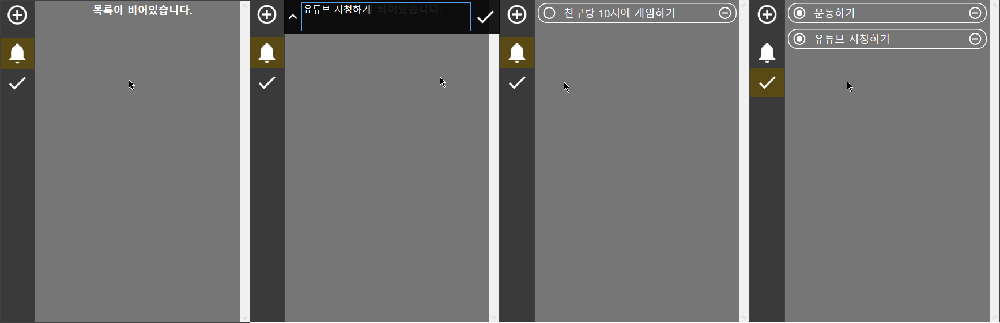

# **To Do List**

## **목차**

1. [To Do List란?](#To-Do-List란)
2. [스크린샷](#스크린샷)
3. [개발 정보](#개발-정보)

### **To Do List란?**

-   나중에 할 일을 까먹지 않게 간단하게 기록할 수 있는 프로그램입니다.
-   할 일을 추가, 삭제 또는 완료로 표시할 수 있습니다.
-   프로그램 종료 시 기록된 할 일들은 데이터 파일로 저장되어 프로그램을 다시 시작해도 그대로 볼 수 있습니다.

### **스크린샷**

### **개발 정보**

-   언어 - [C#](https://docs.microsoft.com/ko-kr/dotnet/csharp/)
-   프레임워크 - [WPF (Windows Presentation Foundation)](https://docs.microsoft.com/ko-kr/visualstudio/designers/getting-started-with-wpf?view=vs-2019)
